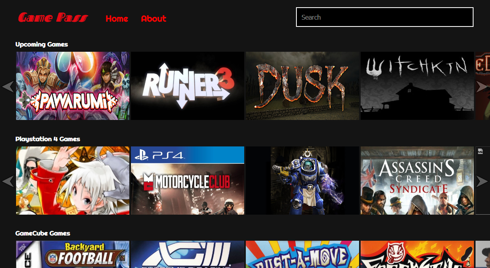
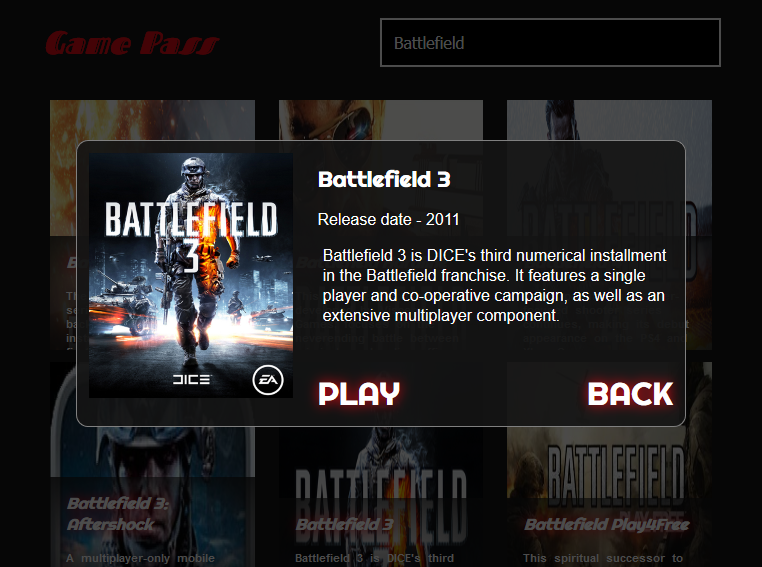
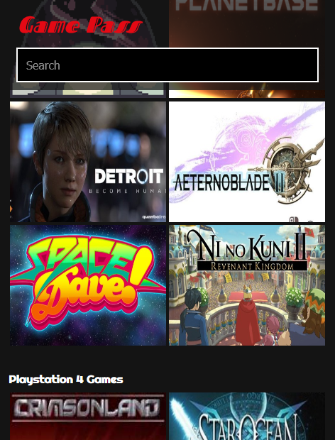

## Game Pass
[A single page responsive application](http://gamepass.surge.sh/) created for **Game Pass**, an online, multi-platform, video game streaming company.  

**Game Pass** allows users to play thousands of games, across many platforms *(sega, gameboy, PS2, Xbox360, etc...)* all on their PC, for a small monthly cost of $12.99.  

[Demo](http://gamepass.surge.sh/)

  

  



## Details
The website runs off React and uses [GiantBombs' Game Database (API)](https://www.giantbomb.com/api/documentation) for prototyping and placeholder data.

Since no backend exists, JSONP is used for to retrieve information from GiantBombs' API in order to avoid CORS issues.  
A custom carousel/slider library called *"Atlas Slider"* was made to achieve an effect similar to Netflixs' carousel.


## Data Configs
[giant-bomb-categories.json](./js/config/giant-bomb-categories.json) contains an array of pre defined categories allowing random database results that have some similarities to be retrieved with ease.  

[sitelinks.json](./js/config/sitelinks.json) defines the links that appear in the header, footer, and other links such as social media links.

The **Giant Bomb API Key** is stored in **js/config/api-keys.json** as  
``` { "GIANT_BOMB_API_KEY": "YOUR API KEY" } ```  

This file is excluded for from GitHub for obvious reasons.  
The application will not function without this file and a correct api key defined in it.

## Documentation
All business logic and those React components that need documentation, are documented using JSDOC syntax *(JSDOC plugin is not used)*.  

[documentation/documentation.js](./documentation/documentation.js) contains definitions and documentation of custom types used throughout the application.


## Tool Chain
#### Esential
- Webpack
- Babel

#### Non Essential
- ESLint
- Prettier
- CSComb: CSS Formater *(because pretty CSS matters to)*
